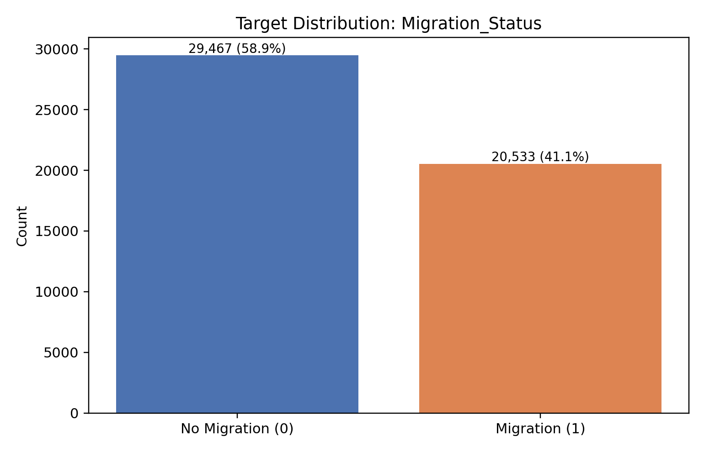
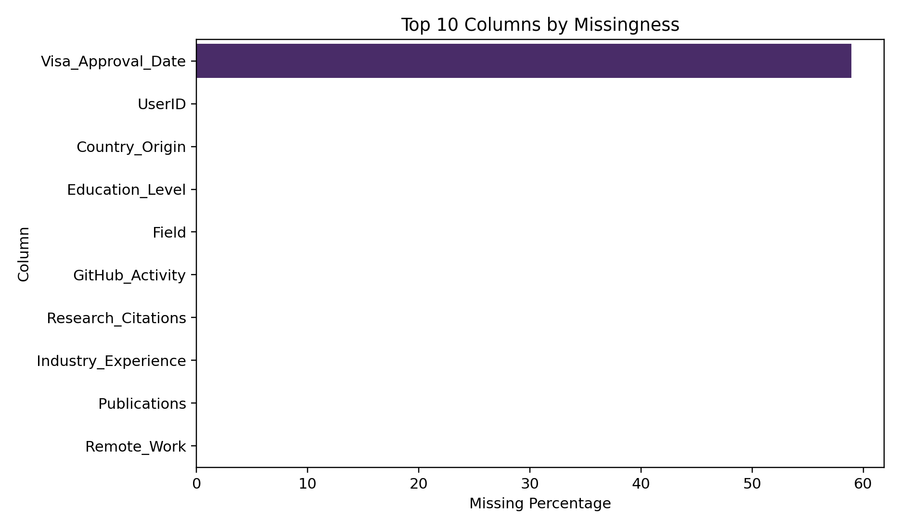
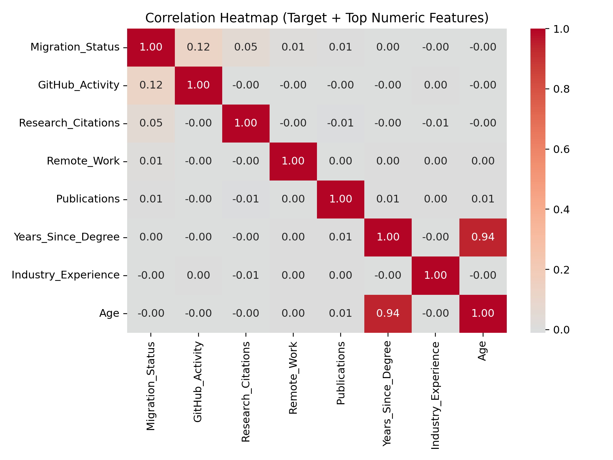
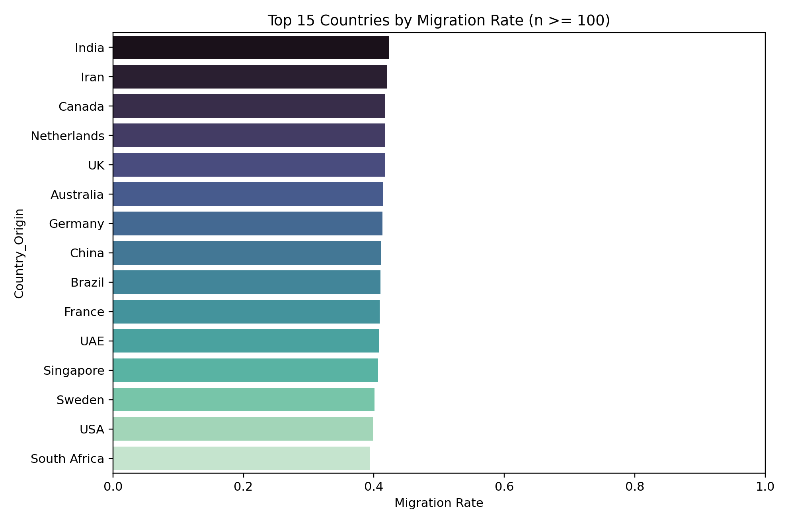
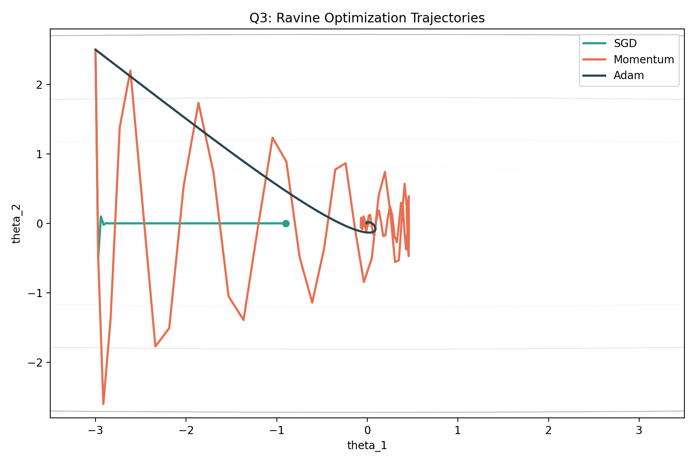
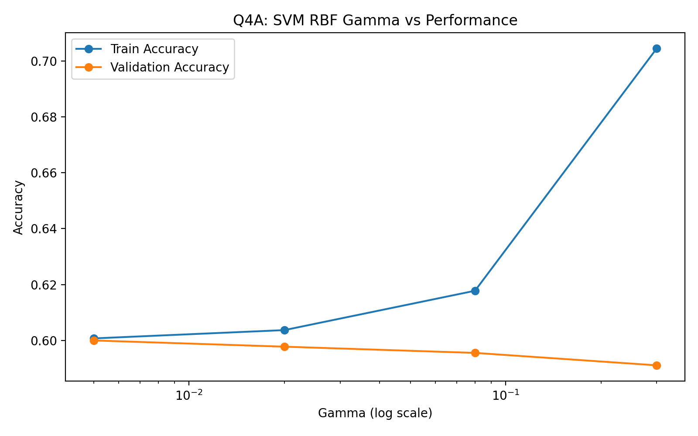
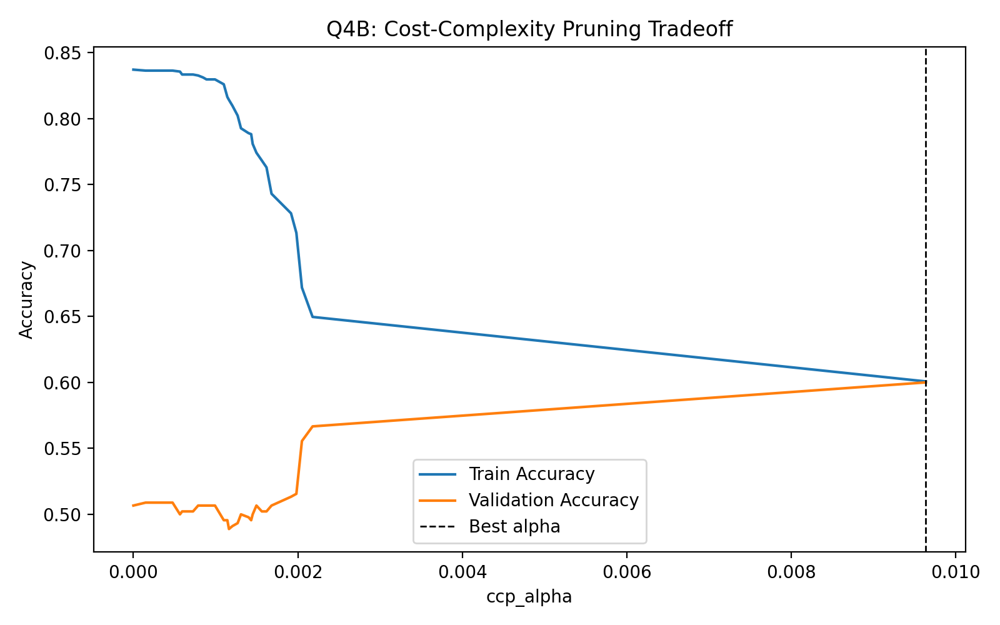
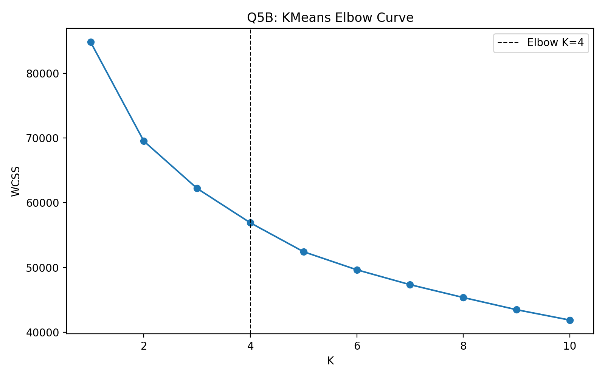
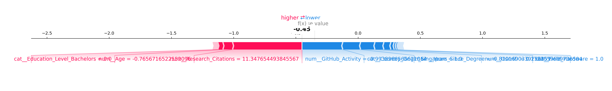
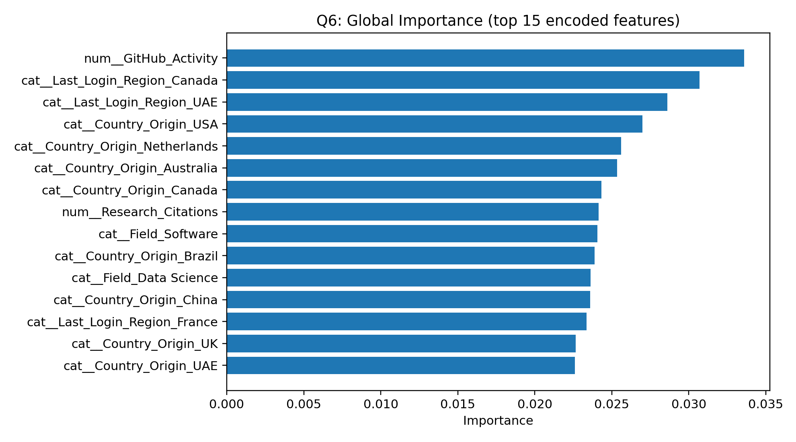

# گزارش کامل پروژه (نسخه فارسی)

## عنوان
تحلیل مهاجرت جهانی استعدادهای فنی با رویکرد داده‌محور  
دانشگاه تهران - دانشکده مهندسی برق و کامپیوتر

---

## 1) خلاصه اجرایی
این پروژه یک پیاده‌سازی کامل و بازتولیدپذیر از چرخه علم داده ارائه می‌دهد که شامل:
- مهندسی داده و SQL پیشرفته
- استنباط آماری و مدل‌سازی منظم‌شده
- تحلیل بهینه‌سازی (SGD/Momentum/Adam)
- مدل‌های غیرخطی و هرس
- PCA و خوشه‌بندی
- تبیین‌پذیری SHAP
- تحلیل زیرگروهی عدالت و نکات حاکمیتی

**نتیجه اجرای فعلی کپستون:**
- مدل: در زمان اجرا از `run_summary.json` خوانده می‌شود (XGBoost در صورت نصب)
- (اعداد به‌روز پس از اجرای `make run`)

---

## 2) داده و کیفیت
- فایل: `code/data/GlobalTechTalent_50k.csv`
- تعداد سطر: `50,000`
- تعداد ستون: `15`
- هدف: `Migration_Status`

### توازن کلاس
- کلاس 0: `29,467`
- کلاس 1: `20,533`
- نرخ کلاس مثبت: `41.07%`

### Missingness
بیشترین مقدار missing مربوط به `Visa_Approval_Date` است (`58.934%`) که هم‌زمان نشت‌زا نیز هست.

### هم‌بستگی اولیه
ویژگی‌های عددی اثرگذار اولیه: `GitHub_Activity`، `Research_Citations`، `Remote_Work`.

### نرخ مهاجرت در کشورها
تفاوت نرخ مهاجرت بین کشورها مشاهده می‌شود و این موضوع نیاز به تحلیل fairness را تقویت می‌کند.

---

## 3) مهندسی داده و کنترل نشت

### SQL تحلیلی
کوئری رسمی Q1 در فایل زیر موجود است:
- `code/solutions/q1_moving_average.sql`

### تشخیص نشت
مقادیر تشخیصی از `run_summary.json`:
- corr(visa_present, target) = `1.000`
- P(Migration=1 | visa_present) = `1.000`
- P(Migration=1 | visa_absent) = `0.000`

**نتیجه:** `Visa_Approval_Date` باید حذف شود.

---

## 4) استنباط آماری و مدل خطی
در پروژه:
- مشتق Elastic Net با زیرگرادیان L1 ارائه شده است.
- تفسیر p-value و CI در پاسخ‌نامه تشریحی مستندسازی شده است.

منابع داخلی:
- `code/solutions/complete_solution_key.md`
- `code/solutions/extended_solution_key.md`
- `code/solutions/SOLUTION_KEY_FA.md`

---

## 5) تحلیل بهینه‌سازی
مقایسه روی تابع ravine:
- SGD final loss: `0.403329`
- Momentum final loss: `0.000823`
- Adam final loss: `0.000034`

تفسیر: Momentum و Adam نسبت به SGD در این هندسه همگرایی پایدارتر و سریع‌تری نشان می‌دهند.

---

## 6) مدل‌های غیرخطی
### SVM (RBF)
- best gamma: `0.005`
- best validation accuracy: `0.5813`
- worst validation accuracy: `0.5740`

### Decision Tree Pruning
- best ccp_alpha: `0.006833`
- best validation accuracy: `0.5813`

---

## 7) بدون نظارت
### PCA
- EVR(PC1): `0.2775`
- EVR(PC2): `0.1449`
- EVR(PC1+PC2): `0.4223`

### KMeans Elbow
- K منتخب: `4`

---

## 8) Explainability با SHAP
خروجی محلی:
- candidate index: `13530`
- prediction probability: `0.5086`
- base value: `0.5000`
- output value: `0.5086`
- top local feature: `num__Research_Citations`

اهمیت سراسری:

---

## 9) عدالت، اخلاق و حاکمیت
خروجی fairness slice:
- `code/solutions/q6_fairness_country_rates.csv`

سیاست پیشنهادی:
- استفاده از مدل به‌عنوان تصمیم‌یار
- بازبینی انسانی برای موارد اثرگذار
- مانیتورینگ drift و بازآموزی دوره‌ای

---

## 10) بازتولیدپذیری
دستورات اصلی:
- `make run`
- `make test`
- `make compile`
- `make report`
- `make latex-fa`
- `make report-fa`

---

## 11) محدودیت‌ها
- داده، همه عوامل واقعی مهاجرت (خانواده، ژئوپولیتیک، شوک سیاستی) را پوشش نمی‌دهد.
- SHAP تبیین توصیفی است و اثبات علیت نیست.
- نتایج کپستون به در دسترس بودن `xgboost` وابسته است.

---

## 12) نتیجه‌گیری
این نسخه فارسی، پروژه را به‌صورت کامل در سطح حرفه‌ای دانشگاهی مستند می‌کند: از داده تا مدل، از ارزیابی تا explainability، و از fairness تا راهکار استقرار.

---

## 13) الحاقیه: سؤالات جدید (Q15-Q20)

- **Q15 (کالیبراسیون و آستانه):** منحنی کالیبراسیون، Brier/ECE، آستانه‌های مبتنی بر F1 و هزینه.  
- **Q16 (درفت):** PSI برای ویژگی‌های عددی، JS برای کشور، سیاست مانیتورینگ و بازآموزی.  
- **Q17 (ریکورس):** حداقل تغییر ویژگی‌های قابل اقدام برای عبور از آستانه، نرخ موفقیت ریکورس، و تحلیل امکان/اخلاق.  
- **Q18 (اعتبارسنجی زمانی):** backtest غلطان، افت عملکرد بین foldها، و تحلیل drift-aware.  
- **Q19 (عدم‌قطعیت):** پوشش تجربی در سطوح اطمینان مختلف با بازه‌های conformal.  
- **Q20 (مداخله عدالت):** مقایسه قبل/بعد mitigation با قید سیاستی برای افت عملکرد.  

پس از اجرای `make run` اعداد دقیق در `code/solutions/run_summary.json` قرار می‌گیرند و artifactهای اصلی در مسیرهای زیر تولید می‌شوند:
- `code/solutions/q18_temporal_backtest.csv`
- `code/solutions/q19_uncertainty_coverage.csv`
- `code/solutions/q20_fairness_mitigation_comparison.csv`
- `code/figures/q18_temporal_degradation.png`
- `code/figures/q19_coverage_vs_alpha.png`
- `code/figures/q20_fairness_tradeoff.png`
- `code/solutions/latex_metrics.json`
- `code/solutions/latex_metrics.tex`
